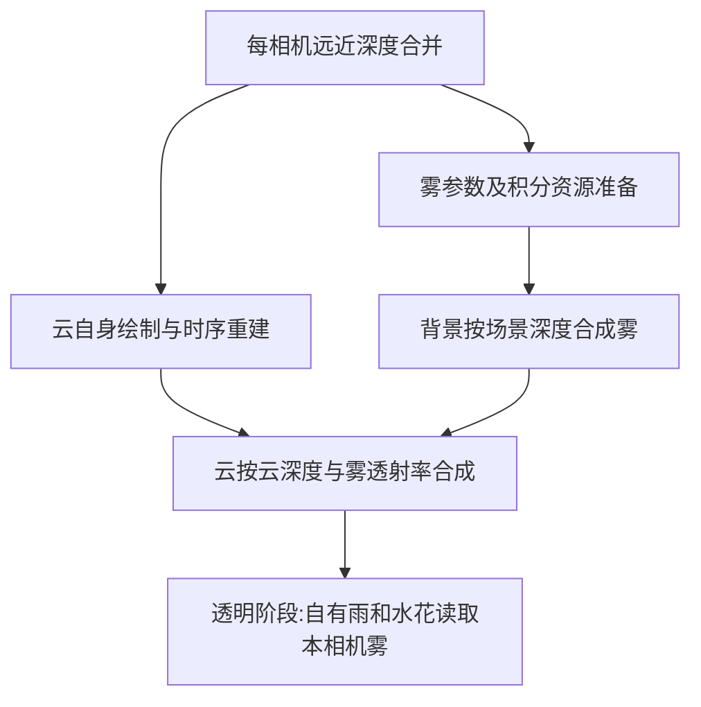

# 雾重做:近地薄雾与流动体积雾

> 状态:🚧 两种雾首版与可操作 UI 已写入原工程;C# 与独立 Unity GPU 验证已完成,游戏内画质、透明水面及性能仍待验证。UI 不可用修复见 §10;掉帧排查与查询纹理见 §11;21:07 游戏日志及调参解耦修正见 §12,纯雾 GPU 开销仍未量定。夜间光照修正与 161 项验证见 §13,游戏画面待验收。
> UI 后续:天气 / 云调试控件已按用户要求移除,见 [UI 清理](archive/user-ui-cleanup-2026-10-09.md);§9.2 的当前排查入口已同步,§10 保留当时修复记录。
> 工具清理:编辑器验证脚本已按用户要求删除,以下 GPU / 性能结果保留为历史证据,详见[开发工具说明](../Assets/Scripts/VolkenTests/README.md)。
> 日期:2026-10-09;源码基线 `5e4bb88`,保留当前工作树中的性能审计文档。
> 【决策:2026-10-09,用户】近地薄雾和明显的流动体积雾**二者都做**。下面的分阶段顺序是交付顺序,不表示体积雾改为可选待办。
> 关联:[会话上下文](AGENT_CONTEXT.md)、[天气解耦](archive/weather-cloud-decoupling-2026-10-01.md) §8、[旧雨雾复盘](archive/weather-rain-fog-postmortem-2026-09-27.md)、[性能清单](proposals/frame-rate-optimization-audit-2026-10-08.md)。

## 1. 要交付的效果与范围

| 效果 | 行为 | 性能路线 |
|---|---|---|
| 近地薄雾 | 远景逐渐隐入雾色,密度随行星海拔衰减;可设置基准高度、距离、密度和颜色 | 单独开启时用解析 / 少量分段积分,无噪声体积和历史 RT |
| 流动体积雾 | 有稀密变化和风向的雾团,可飞入 / 穿出,光照随太阳方向及昼夜变化 | 有上限的相机体积网格、3D 噪声与累积散射;低 / 中 / 高档 |
| 两种同时开 | 均匀底雾上叠加雾团,两种密度各自可调 | 在同一积分中合并消光与散射,避免对同一背景重复加雾 |

交付包含:单独开关、天气预设存取、三语面板、主视图与 PIP、无云也可显示雾、浮动原点稳定、雨 / 水花 / 云的相容性、功能和性能验证。

首轮体积光照做环境光与太阳方向散射。建筑 / 云投影形成的光束、多光源阴影、任意局部雾盒和贴合山谷地形的密度场列为扩展;它们需要额外遮挡或空间数据。以海拔分布的雾不会自动贴合每座山的地表。游戏原生透明材质和水反射的适配边界见 §5,不能用“全屏效果已出现”代替这些验收。

## 2. 实施前核对与需要处理的问题

本节保存实施前基线,不代表现状;当前结果见 §9。以下源码相对 `Assets/Scripts/Volken/`。

| 位置 | 当前事实 | 对实施的影响 |
|---|---|---|
| `Weather/VolkenWeatherConfig.cs:151–186、348–353` | FogSection 已有字段、复制和限值;`enabled=false,density=0`;没有运行时消费者 | 复用 XML 的 Fog 节点,明确旧字段单位;不能只打开 UI |
| `Weather/WeatherPanel.cs:359–384` | 雾整组控件禁用,三语言描述“已移除” | 功能接入时同时替换文案 / 控件,不留下无效开关 |
| `Clouds/CloudRenderer.cs:649–667、707–714` | 无远深度或无活跃云层时直接返回;深度合并在返回之后,材质来自第一层云 | 深度生产必须脱离“有云正在画”的条件,避免关云后雾消失或读旧深度 |
| `Clouds/FarCameraScript.cs:26–30、74–79` | CommandBuffer 抓远深度;深度材质依赖主云材质 | 改为独立深度资产 / 实例,保留远相机捕获事件,不改成远相机 OnRenderImage |
| `Clouds/Shader/Clouds.shader:1339–1424` | 合成有 Standard / Additive 两种;云 RGB 是累积光、A 是透射率 | 雾与云必须按深度和透射率合成;不能简单前后各 Blit 一次 |
| `Weather/VolkenWeather.cs:466–486` | LocalSolarHour 仅靠太阳夹角,范围 / 正午注释与公式不一致,也不能区分早晚 | 不能直接用其“5–6 点”条件驱动雾 |
| `Clouds/PlanetEnvironment.cs` | 已有在飞行 / 天体 / 大气门控 | 沿用行星事件与环境快照,不恢复全局天气值或云联动 |

旧雾文件已删除,历史临时 stash 不存在。旧母计划中的 `DepthCapture`、天气状态机、默认执行顺序和部分公式仅作历史参考。独立新增两个图像回调再靠 `[DefaultExecutionOrder]` 猜先后,不能作为本方案的合成顺序保证。

本次已核对 Unity 2022.3 文档:带 `ImageEffectOpaque` 的效果位于不透明之后、透明之前;默认相机深度通常只包含队列 ≤2500 且具有可用深度 / ShadowCaster 路径的物体。[回调时机](https://docs.unity3d.com/2022.3/Documentation/ScriptReference/ImageEffectOpaque.html)、[相机深度限制](https://docs.unity3d.com/2022.3/Documentation/Manual/SL-CameraDepthTexture.html)。

## 3. 首选结构

### 3.1 共用一次明确的渲染顺序

保留当前近相机 `CloudRenderer.OnRenderImage` 的显式入口,按需调用雾模块。雾配置 / 生命周期仍归天气;这里的调用只确定绘制顺序,不让天气修改云配置。



- 深度更新放到云为空的早退之前,按云 / 雾 / 雨软粒子的消费者需求判定;无云时不因雾渲染而新增分配 / 执行云 MV 或 TSS 链。云初始化已有的噪声资源不在本轮擅自重构。
- `FogRenderer` 使用显式 Render / Bind 调用,不再增加一个顺序不明的 `OnRenderImage`。它是每相机持有的专用对象,不是新全局管理器。
- `FogView` 持有本相机材质、体积纹理和历史;低清尺寸按该相机 targetTexture 计算。云、雾和雨保留独立开关。
- 共享线性场景深度继续使用米为单位的 LinearEyeDepth;雾内部沿射线积分前转换为射线距离。天空深度 / 远裁剪哨兵单独标识。
- 主视图保留远 / 近相机配对;只有一台相机的 PIP 使用本相机深度。资源缺失或不支持时直通并给节流状态,不使用别的相机纹理冒充。
- 必须检查纹理创建帧与有效帧。雾消费在合并之后;雨的 OnPreCull 与透明绘制之间的纹理绑定时机单独验证,避免为了加有效性判断反而拒绝本帧稍后写入的 RT。

### 3.2 高度与坐标

高度按 `h = |位置 − 行星中心| − 行星半径` 定义。CPU 用游戏参考系和双精度位置取得相机海拔 / 行星相对位置,shader 使用相机相对射线,不把世界 Y 当海拔。

低海拔 / 大半径下,直接用两个大浮点数相减会丢精度。可用相机已知海拔 `h0` 与下式计算沿射线的高度增量:

```text
r0 = R + h0; mu = dot(径向上, 单位射线); s = 射线距离
deltaH = (2*r0*mu*s + s*s) / (sqrt(r0*r0 + 2*r0*mu*s + s*s) + r0)
h(s) = h0 + deltaH
```

雾团噪声锚定行星参考坐标。CPU 先对纹理周期取模 / 拆分高低位再传 float,避免大坐标噪声抖动;不同相机看到同一处雾团应一致。重定位、参考帧旋转、SOI 切换都要校验噪声相位与历史,不能仅把雾称为“相机系”便忽略重定位。

从高空向下看仍应看到低空雾层。是否有贡献按射线与雾区间相交判断,不按“相机高于雾顶”直接关整个效果。天空方向只积分有限范围内的雾,不把整片太空涂白。

## 4. 两种雾的计算路线

### 4.1 近地薄雾

建议保留字段名,明确 `height` 为**高度尺度**、`heightFalloff` 为无量纲衰减强度,其有效 e-folding 高度 `H = height / heightFalloff`。`baseHeight` 改显示为“密度基准海拔”;低于基准密度封顶,高于基准指数下降。已有占位值仍可反序列化,不暗改用户 XML。

```text
sigma(h) = density * exp(-max(h-baseHeight, 0) / H)
tau(D) = integral(sigma(h(s)), s=startDistance..D)
T(D) = exp(-tau(D)); S(D) = fogLitColor * (1-T(D))
```

近距离、曲率误差足够小时使用局部高度线性化后的解析积分。设某一段长度 `L`,起止高度 `ha/hb` 均不低于基准,`q = abs(hb-ha)/H`:

```text
tauSegment = density * L * exp(-(min(ha,hb)-baseHeight)/H) * E(q)
E(q) = (1-exp(-q))/q
q 接近 0 时:E(q) = 1-q/2+q*q/6-q*q*q/24
```

穿过基准高度时分段;整段位于基准以下则 `tau=density*L`。startDistance 前的路径不计雾。不要照抄旧文档的系数表达式:光学厚度必须无量纲,均匀雾必须退化为 `density*L`。shader 不依赖此前编译失败的 `expm1`。

长距离水平视线必须纳入行星曲率。实施时对 4 / 8 / 16 段径向高度近似与高采样参考做误差对照,以误差和画质选预算;不能仅靠相机径向上的一个平面无限外推。例:半径 1,274,000 m 的示例球体上,20 km 水平切线末端已升高约 **157 m**,足以改变薄雾密度。

只开薄雾时:一次全屏合成,云合成时按云深度再求便宜的雾前缀;不生成 3D 噪声体积、不引入时序历史。雾关闭 / 密度为零则不做雾 pass。

### 4.2 流动体积雾

首选受预算限制的**相机视锥体积网格**:屏幕 XY 粗分格、Z 按距离分层,每个小格称一个 froxel。它保存从相机到不同深度的累积雾光和透射率,使地面、云和自有透明物体都能按各自距离查询。

流程:

1. **密度 / 光照注入**:独立的可重复 3D 噪声产生雾团;输入径向高度、噪声尺度、覆盖 / 对比度、流向与速度。先用一个基础噪声与可选细节,不复制云层整套多重光步进。
2. **合并介质**:两种都开时,用 `sigmaTotal = sigmaHeight + sigmaVolume`,散射源项相加,沿射线积分一次。体积单独开时基础项为零。
3. **沿 Z 累积**:每列从近到远累计 `(S.rgb,T)`;常系数小段用指数形式,极小消光时取极限,不除零。第一段覆盖相机到首个深度边界,startDistance 内密度为零。
4. **深度采样 / 合成**:按场景、云或透明片元的深度读累积体积;屏幕重建结合全清场景深度,检查轮廓泄漏。Z 插值要核对透射率误差,不能默认线性插值对所有雾密度都足够。
5. **时序作为质量增强**:先验证无历史版本,再加重投影 / 邻域限幅 / 深度拒绝。暂停时风停止;相机切换、重定位、质量 / 预设变化与快速运动使历史失效或降权。不得直接复用云 TSS 历史。

雾颜色来自独立颜色参数、环境光与太阳方向散射。`colorBlend` 以可核实的环境色为混合来源,先验证游戏昼夜环境光 API;缺失时用配置颜色降级,不读取已合成场景颜色形成反馈。避免夜间自发白光;线性 / Gamma、HDR 与源 alpha 均须验证。

`maxOpacity` 是艺术上限,必须同时一致地处理 T 与 S,不能只改 alpha 而保留原散射亮度。设置、资源加载失败或硬件不支持 compute / 3D 随机写入时,显示明确状态;薄雾可继续运行。

### 4.3 为什么选这条路线

| 方案 | 优点 | 在本项目的取舍 |
|---|---|---|
| 直接开启 Unity 全局 fog | 接入短 | 不能假定游戏 / 模组 shader 支持相同 fog,也缺少明确的行星高度与云合成控制 |
| 低清 2D 屏幕 raymarch,只存场景终点结果 | 资源少、容易做首个演示 | 只有终点 S/T,不能正确回答前方云或雨滴处积累了多少雾;要额外前缀输出 / 重算 |
| 视锥体积网格 + 累积 S/T | 一次积分可供任意深度查询,两种雾可合并 | 推荐体积雾路线;显存与分层精度需要预算,先做最小 GPU 原型验证 |

这不是已测出的最优实现。若原型表明 3D 资源 / 调度不适合目标设备,可转低清 2D raymarch 加云深度前缀输出,仍须满足两种雾和深度合成要求。

## 5. 云、透明物体和水面的合成契约

### 5.1 云不能当成不透明地面

把雾简单放在云前,云会缺少前方雾遮挡;放在整个合成之后并使用地面深度,又可能让前方云承受过长雾程。

先将云视作有效深度处的一层,推导可验证的合成近似。设背景为 B,云累积光为 C、透射率为 Tc,雾到场景深度为 `(Sg,Tg)`,到云深度为 `(Sc,Tf)`:

```text
先算有雾背景: Bfog = Tg*B + Sg
Standard 云: out = Tc*Bfog + Tf*C + (1-Tc)*Sc
Additive 云: out = Bfog + Tf*C
```

这样不会让云再次遮住已经位于相机与云之间的雾。现有 Composite 的 nearFactor / depthMask 必须先折算进有效 C/Tc,雾关闭时输出保持现状。保留 Additive 的艺术语义。

**适用限制**:当前 `cloudDepthTex` 是首次有效云距离,不是整个分布式云体的精确散射深度;该层近似对云雾重叠、双层云和轨道交叉淡入需要实测。体积 / 轨道分别求雾衰减再交叉淡入;轨道深度由相应云壳求交提供,不能误用失效的体积云深度。若重叠场景不合格,将雾透射查询下沉到云的采样 / 积分阶段,不能宣称单层公式已解决所有体积排序。

### 5.2 自有透明物体

雨滴与水花 shader 按片元 / 顶点世界位置取得当前相机雾前缀,遵守各自 blend 模式;先验证“只衰减反射 / 发光贡献”与“增加雾色”的正确组合,避免重复把背景雾加一次。远雨不能穿过浓雾保持全亮。

纹理按实例绑定;生成、绑定、执行顺序用 GPU 捕获核对。不能把主视图纹理全局广播给 PIP。雷电发光可先乘雾透射率,雾被雷光短暂照亮须通过显式、有预算的光照输入实现。

### 5.3 游戏原生透明材质、水面与反射

不透明前后的全屏雾不会自动正确覆盖稍后渲染的玻璃、水面和尾焰。已查游戏 `WaterTransparencyCameraScript.cs:93–106`:在 `BeforeForwardAlpha` 抓折射图;需实际确认该抓图与雾绘制的关系。`SceneMasterCameraScript.cs:292` 最后拷贝场景 RT,不应把雾随意挂到这个终端相机。

首轮先验证原生材质保持可见、折射不被覆盖、无 UI 泛白。水面反射雾单独沿反射相机射线采样低档雾,不得直接套主视图体积纹理。对无法从模组修改的透明 shader,如不能得到其表面深度 / alpha,记录为**未完成的适配边界**,不用一次无差别后处理声称已修好;后续按实际可用水面 / 透明材质接口补足。

水下按实际相机位置抑制空气雾,并验证海面上下切换。基础高度 / 空气雾不替代游戏水下散射。

## 6. 配置和文件改动清单

### 6.1 配置建议

| 字段 / 分组 | 语义与兼容 |
|---|---|
| `fog.enabled` | 雾总开关,默认 false;不依赖雨或云开启 |
| 新增 `heightEnabled` | 基础薄雾开关;默认 true,因外层总开关默认关而保持关闭行为 |
| 保留 `baseHeight,height,heightFalloff,density` | 改清文案 / 单位,按 §4.1 解释;密度仍默认 0,提供显式示例预设方便看到效果 |
| 新增 `volumetricEnabled,volumeDensity` | 体积雾独立开关 / 密度,默认 false / 0;不可悄悄把旧 density 同时用于两种雾 |
| 体积雾质量 / 形状 | 质量档、噪声尺度、覆盖 / 对比度、流向 / 速度;提供安全限值,不让用户直接设无限格数 |
| `startDistance,maxOpacity,colorBlend` | 两种共用;新增 `maxDistance` 和明确雾颜色 / 光照强度,防天空无限积分 |
| 保留 `dawnFog` | 显示改为“晨昏增强”;用太阳仰角的平滑权重,两侧对等触发,不依赖错误的 LocalSolarHour |
| 新增 `ExtraCameraFog` | 单独控制附加相机,默认关闭;开启后默认低档,不修改主相机配置 |

晨昏增强应基于非零的用户密度乘倍率,不能在用户 density=0 时偷偷生雾。NaN / Infinity、负数与极大值要在 Clamp 中变成有限合法值;同步 CopyFrom / Clone、保存 / 加载和 EN-US / ZH-CN / RU-RU。

建议示例值用于原型调参,不是自动写入用户预设:薄雾 `density=0.0003 /m,H=200m`;体积雾先以约 500–1500 m 的雾团尺度观察,随后按参考截图与实际视距校准。两种共同启用时检查浓度是否过饱和。

### 6.2 文件落点

以下为首版文件分工;体积资源直接归本相机的 FogRenderer,未额外拆 FogView。

| 文件 | 职责 |
|---|---|
| `Weather/Fog/FogRenderer.cs` | 显式绘制入口、参数快照 / 环境门控、每相机资源管理 |
| `Clouds/SceneDepth.cs` | 独立深度资产加载、5 秒失败重试,创建每相机材质 |
| `Weather/Fog/Shader/FogCommon.cginc` | 径向高度、密度、单位、深度映射、S/T 查询约定 |
| `Weather/Fog/Shader/HeightFog.shader` | 单独薄雾积分和全屏合成 |
| `Weather/Fog/Shader/VolumetricFog.compute` | 每 XY 列单线程沿 Z 直接积分,只写一张累计 S/T 纹理;首版无历史 |
| `Clouds/Shader/SceneDepth.shader` | 从现有深度逻辑提取独立资产,供近 / 远深度使用 |
| `CloudRenderer.cs / FarCameraScript.cs / Clouds.shader` | 深度独立、雾插入点、云深度与透射合成;保持旧路径回归 |
| `VolkenWeatherConfig.cs / WeatherPanel.cs / ModSettings.cs / VolkenUserInterface.cs` | 参数、面板、PIP 开关与相机发现 |
| `RainParticles.shader / RainSplashes.shader / LightningBolt.shader` 及调用侧 | 自有透明材质按当前相机取得雾信息 |
| `Assets/ModData.asset` 与新增 `.meta` | 资源 GUID、加载路径、打包清单一起更新 |
| `Assets/Scripts/VolkenTests/` | 雾预览 / GPU 验证入口;正式代码不引用测试类型 |

只提取当前需要的深度和雾职责,不建立通用渲染注册表或天气状态机。

## 7. 性能预算与原型选择

薄雾成本主要来自全屏像素数和积分复杂度;体积雾主要来自网格体素数量、噪声 / 光照注入和累积。**不用新的场景相机去重复画地形深度**,复用原本近 / 远深度路径。

首版采用以下上限,尚未做游戏性能标定。XY 为视图尺寸除以 8 后向上取整并限幅;Z 采用平方分布,近密远疏。存储额外保留一个相机原点边界,避免近处直接读取第一段末端的雾。

| 体积档 | 最大 XY × 积分段数 | 单张 RGBAHalf 3D 纹理(含起点) | 用途 |
|---|---|---|---|
| 低 | 160×90×32 | 约 3.63 MiB | PIP / 低预算 |
| 中 | 240×135×48 | 约 12.11 MiB | 主视图默认质量 |
| 高 | 320×180×64 | 约 28.56 MiB | 质量对照 |

实际实现合并了注入和累积,比原定两张体积纹理少一张。上表不含驱动对齐、已有云 / 输出 RT、共享 32³ R8 噪声与辅助深度;高档只有足够大的视图才达到表内 XY 上限。没有历史纹理和常驻 GPU 回读。多相机各自累加,反射雾尚未接入。

性能验证以同场景雾关 / 仅薄雾 / 仅体积 / 二者开、再加 PIP 为序,记录平均与 P95 / P99 帧时间、CPU / GPU 毫秒和显存。若体积显存或帧时间超预算,先降网格 / 细节,再评估 2D 前缀方案;不靠常驻 GPU 回读测性能。

## 8. 实施顺序与完成判据

| 阶段 | 具体工作 | 进入下一步的证据 |
|---|---|---|
| F0 深度 / 合成原型 | 独立深度材质,零云层仍产深度;雾的距离 / 高度 / T 调试视图;体积纹理写入 / 采样最小验证 | 云关 / 开、主视图 / PIP、远近裁剪交界方向均正确;GPU shader 实际执行 |
| F1 薄雾 | 径向高度、积分、天空范围、颜色、配置 / UI | 密度 0 恒等,水平 / 仰俯 / 高空向下正确,无黑屏 / NaN / 远近缝;独立开关可用 |
| F2 体积雾 | 噪声锚定、注入 / 累积、质量预算、两种密度合并 | 雾团能穿入穿出且不贴镜头,单独 / 同开均有效;同世界位置多相机一致 |
| F3 合成与时序 | 云深度前缀、自有雨 / 水花 / 雷电、可选历史 | 云不穿雾发亮、不双重白化;透明片元深度正确,快速运动与重定位无长拖影 |
| F4 游戏适配 / 打包 | 三语、XML 往返、晨昏、PIP、水面 / 原生透明 / 反射验证;bundle 资源核对 | 新资产在实际包中可加载;关闭后回到原画面;逐项写出已通过 / 仍受限 |
| F5 画质 / 性能收束 | 地面 / 山地 / 云内 / 夜间 / 海面 / 高空 A/B | 可重复时长测量、固定视角对照与用户画面确认;两种效果均完成再收工 |

不把“薄雾可见”作为整个任务完成。体积雾、开关组合、多相机和明确的适配边界都要形成记录。

## 9. 首版实施结果(2026-10-09)

### 9.1 已落地

- `SceneDepth.shader / SceneDepth.cs` 独立加载,远深度保留 `AfterForwardOpaque` CommandBuffer;近深度可在零云层、无 FarCamera 时生成。PIP 不再借用无关的主相机远深度。
- `FogRenderer` 由每个 `CloudRenderer` 持有,先雾化背景再逐层合云;高度雾和体积雾各自开关 / 密度,同开时只积分一次密度和散射。
- 薄雾使用径向海拔、基准以下恒定密度、指数衰减和分段解析积分;球壳 / 地表 / 距离共同限定射线范围。相机海拔先在双精度行星坐标求出。首版逐片元积分已被 §11 的小型查询纹理复用替代,原积分保留为兼容回退和对照。
- 体积雾使用每相机独立 compute 和累计 3D RT。噪声固定在行星坐标,CPU 用双精度取周期余数后上传;风只读取排除暂停的时间,不会因 PIP 多渲染一次而多推进。
- 颜色受环境光、太阳仰角和方向散射影响;晨昏增强使用太阳夹角,最多 2 倍,不再依赖 LocalSolarHour。无大气、天气关闭、水下、零密度时门控;正交相机明确不支持。
- Standard 云按前景雾透射 / 散射补偿,Additive 云只衰减发光;轨道云按壳交点估算距离。自有雨、水花、闪电 / 闪光接入相机雾查询,查询会检查当前相机位置与视图基向量。
- 主相机关闭时清全局绑定;附加相机设置 `ExtraCameraFog` 默认关闭,开启后独立低档。反射云材质明确不消费主相机的雾。
- 面板启用全部雾参数,提供薄雾 / 体积 / 同开示例;状态、诊断视图及日志按钮随后按 UI 清理决定移除。示例会开启天气总开关,设置海平面基准、H=250m、薄雾 0.0003/m、体积 0.0015/m;保存仍需点“保存当前配置”。
- 新字段同步 CopyFrom / Clone / ClampAll / 三语。新增 3 个运行时 shader/compute 资产及 `.meta`,加入 `_otherAssets`；总数从 36 增至 39。雨 shader 部署标识由 8 升为 9。

### 9.2 日志与“看不见”定位

按用户要求,雾日志默认较详细;使用 `Mod.Diag`,不依赖开发日志开关。其余雨日志策略维持原有手动诊断。

| 日志前缀 | 内容 / 触发 |
|---|---|
| `Fog UI ready: build=3 controls=enabled diagnostics=hidden` | 创建雾面板时输出,包含配置是否存在、天气是否激活;用于确认实际加载可操作 UI |
| `Fog attached / release` | 相机挂载 / 销毁及绘制准备次数 |
| `Fog state` | 仅状态变化时输出:disabled、天气 / 大气门控、水下、零密度、资源缺失、实际薄雾 / 体积模式等 |
| `Fog depth asset / assets / build` | 资源加载、shader 版本、compute / 3D 支持、渲染 API / 色彩空间及适配边界;缺资源 5 秒重试 |
| `Fog allocate` | 每相机网格尺寸及理论纹理显存 |
| `Fog render` | 启用诊断时每 5 秒输出:相机、模式、尺寸、ASL、实际 H、两类密度、最远距离、不透明度、晨昏倍率、网格、诊断视图 |
| `Fog depth` | 同步每 5 秒输出:远深度来源、是否已创建、相机裁剪面、活跃云数和合并深度状态 |
| `Fog preset / diagnostics / snapshot` | 示例点击或开发代码调用 `FogRenderer.DiagnoseAll()` 时记录;后者列出 GPU 型号及各相机状态 |
| `Fog GPU depth / volume` | 仅手动请求后在下次有效绘制异步回读:深度中心 9×9,体积中心一列;输出有效性、T 范围、末端 T、最大散射和非单调计数 |

没有每帧 GPU 同步回读;异步回调核对实例和资源版本,避免把销毁 / 重建后的结果当成当前状态。3D 纹理按 `GetData(layer)` 逐片读取,依据 [Unity 2022.3 回读接口](https://docs.unity.cn/2022.3/Documentation/ScriptReference/Rendering.AsyncGPUReadbackRequest.GetData.html)。

排查顺序:

1. 在海平面附近点击“应用混合雾预设”,在日志中检查 `Fog state` 为 `height+volume`;示例基准为 ASL=0,山顶不保证有浓雾。
2. 看 `Fog assets / build` 是否加载成功,`Fog depth` 是否有正常尺寸 / 深度源;资源缺失先核对原工程资产清单是否仍含该 GUID;本轮曾发现 compute / 深度引用缺失,见 §11。
3. 开发排查可在天气 XML 中设置 `fog.debugMode`:1 看透射,全白表示该视线几乎无雾;2 看场景深度,3 看累计散射。修改 XML 后重新载入场景;游戏面板不再显示诊断滑块。
4. 必要时由开发代码显式调用 `FogRenderer.DiagnoseAll()` 请求 GPU 自检;游戏面板入口已移除。`invalid=0`、`nonMonotonic=0` 是基本健康条件;中心视线上方无雾时 `T=1` 也可能正常,不能单凭一个中心采样判故障。
5. 排查结束恢复 `debugMode=0`;需要减少摘要时在开发配置设置 `fog.diagnostics=false`。生命周期和资源异常日志仍保留,正常调参使用游戏面板。

### 9.3 已执行验证

- 当前工作树 `dotnet build Volken.csproj --no-restore` 为 **0 错误 / 3 个既有警告**(Tasks.Extensions 版本冲突、两处星环不可达代码)。本地 csproj 已包含新增正式源码,不提交其私有依赖路径。
- 独立 Unity **2022.3.62f3 / D3D11 / RTX 5060 Laptop GPU** 当时使用 `FogGpuProbe.cs` 验证(该工具现已删除)。实际跑 shader pass、compute、读回及新资产独立 bundle 的构建 / 加载;最终结果 **64 项通过 / 0 失败**。该轮临时测试工程位于 `Temp/FogProbe`,其日志已随 Unity 清理 Temp 移除;本条为当时执行记录,不表示临时输出仍保留。
- 覆盖:7 个 shader 和对应 pass、薄雾密度 0 / 关闭恒等、alpha 保留、起始 / 最大距离、球壳外无雾、不透明度上限、体积原点、常量密度积分、有限值 / 单调性、三维深度插值、空噪声、两种密度相加、上下朝向、3 组相机旋转下 9 条射线对照数值积分、云 Standard / Additive、近远深度选择、旧 XML / 全字段复制 / 往返 / NaN 限值。
- 测试发现并修正纹理 UV 的 D3D Y 翻转:雾从纹理 UV 重建射线,使用 `GL.GetGPUProjectionMatrix(..., false)`;云 raymarch 的光栅 clip / TSS 仍用既有 `true`,不能统一替换。另修正 3D 回读只取第 0 片的诊断问题。
- 独立新资产 bundle 能证明 shader/compute 打包路径,**不等于完整 Volken.sr2-mod 已构建 / 安装**。本轮未覆盖安装目录,未启动游戏做画面验收。

### 9.4 当前边界与下一步

- 两种雾的渲染首版已完成,但 F0–F3 的游戏相机 / 场景矩阵、F4 游戏适配和 F5 性能验收尚未关闭;本文继续留在活跃文档,不归档。
- 游戏原生水面、玻璃等透明材质、折射及镜面 / 机体反射雾尚未适配。水面仍可能出现无雾覆盖或反射不一致;当前仅阻止反射误用主相机雾,不能称为水面已完成。
- 云雾重叠使用云首个命中点 / 轨道壳距离,不是云内每一步联合积分。多云层、云内、地平线和高空向下需要真机检查近似误差。
- 体积无历史累积,低档可能有网格 / Z 分段可见性;不引入 TSS 拖影,后续是否需要历史由画质与耗时测量决定。
- 正交附加相机不支持,透视 PIP 已接入独立资源但未做游戏窗口 A/B。主视图 / PIP / 反射嵌套、切场景、浮动原点和星球切换仍需回归。
- 下一步:用户通过原工程更新游戏后,用 §9.2 日志验证实际生效;在地面 / 海面 / 云内 / 夜间 / 高空及远近裁剪交界观察。固定视角分别记录关雾 / 薄雾 / 体积 / 同开 / PIP 帧时间后再报告开销,本次混合场景的 FPS 记录见 §12,尚不能分离纯雾开销。本轮按用户要求只处理原工程源码和文档。

## 10. 雾 UI 不可用与原工程修复(2026-10-09)

### 10.1 证据与原因

- 读取用户指定 `Player.log`,文件更新时间为本地 20:16:29;加载行是 `Mod Loaded: Volken, Version 0.64`。日志已有云 / 雨初始化,没有任何 `Fog` 日志,也没有雾面板创建异常。
- 原工程的 `WeatherPanel.BuildFogGroup` 仍显示 `WeatherFogRemoved`,通过 `AddDisabledToggle / AddDisabledSlider` 创建禁用控件。雾运行时和新面板当时只存在于独立工作树,原工程没有这些改动。
- 因此原工程中的禁用占位直接解释了 UI 不可操作,日志也与旧实现一致。没有把普通零密度 / 高海拔导致不可见误当成本次 UI 故障。

### 10.2 已修正

- 将 §9 的雾渲染、独立深度、三语面板、配置和资源引用完整写入原工程,保留原工程版本 `0.64`。写入前核对已有修改,已修改文件保留本地备份,写入后逐文件核对哈希。
- 删除禁用雾控件和旧说明;清理三语中未使用的 `WeatherFogRemoved / WeatherRainRemoved / WeatherNotImplemented` 文案及配置中的过期占位注释。
- 雾面板提供薄雾 / 体积雾 / 同时启用三个示例、独立开关与参数、诊断视图和手动日志按钮。创建面板时输出 `Fog UI ready: build=2 controls=enabled`,可直接区分新旧 UI。
- 同步实施记录、索引与会话上下文。此次原工程源码更新不代表游戏内画面已经验收。

【决策:2026-10-09,用户】后续直接在原工程 `<PROJECT>` 动工,本轮不负责打包;原工程映射见本地路径表。游戏内效果与性能验收仍按 §9.4 保留。


## 11. 启用雾掉帧排查与优化(2026-10-09)

### 11.1 最新游戏日志与证据范围

- 读取本地 20:40:31 更新的 `Player.log`,111230 字节。已加载 `Fog UI ready: build=2`,雾运行时代码 / shader 仍为 1。
- 有效相机只有 `NearCamera`;输出 2560×1600、两层云。先运行 `height`,之后为 `height-only(volume-unavailable)`;一直 `compute=False / grid=none`,没有体积 RT 分配记录。此次掉帧不能归因于体积网格过大或多个雾相机。
- 雨缓冲记录为 100000 粒子;当前 Stormy XML 开启雨碰撞与水花,雷击间隔 0.5–1 秒。XML 是保存值,不保证与每次 UI 临时调参完全一致。
- 日志缺少关雾基线和 CPU / GPU 帧时间,不能仅凭 5 秒心跳的 draws 数量断言雾造成多少毫秒损耗。读取时原工程 `_otherAssets` 只有 37 项,缺体积雾 compute 与独立深度 shader 引用;何时移除未查明,本轮补回至 39 项。

### 11.2 源码改动

- 单独薄雾 / 体积不可用时,按径向夹角与距离生成 **513×257 RFloat** 光学厚度查询纹理,每相机约 **0.503 MiB**。每帧只在这张小纹理上积分,背景、各云层及自有透明材质共享查询结果。角度用三次映射,距离用平方映射,提高地平线与近处精度;不增加几何深度相机。
- 原分段积分仍用于生成查询纹理及 shader 不支持新 pass 时的兼容回退。体积雾启用时保持原 3D 累积管线;两种纹理互斥持有,关闭雾 / 相机释放时销毁。新增 pass 后合成显式指定 pass 0,避免一次 Blit 执行全部 pass。
- 复用已知世界射线,避免背景 / 云查询时重复矩阵逆投影。相机海拔高于雾层顶加最大积分距离时,直接报告 `outside-fog-reach` 并跳过雾绘制。
- 恢复资源引用;体积资源缺失时重试间隔从 5 秒改为 30 秒,资源状态日志去重。构建探针更新为 `Fog build: code=2 shader=2`。
- 新增 `Fog perf / Fog frame timing / Fog context / Fog path`:按状态分别统计开 / 关雾的整帧均值、最大值、FPS、CPU 指令提交耗时、分配次数、查询路径、雨粒子数 / 碰撞 / 水花 / 闪电数 / FOV。整帧 GPU / 主线程时间仅在 Unity FrameTimingManager 可用时输出,否则 -1。这些值不是单独雾 pass 的 GPU 耗时。状态切换清窗口,避免把开 / 关混在一起。

### 11.3 已执行的测试

- 原工程 `dotnet build Volken.csproj --no-restore`:0 错误 / 3 个既有警告。
- 独立 Unity 2022.3.62f3 / D3D11 / RTX 5060 Laptop GPU:渲染 / 配置 / 查询纹理 / 雨 shader 回归 **96 通过 / 0 失败**,本轮未执行打包入口。
- 30 组查询纹理与解析积分画面对照:包含用户 H=250 / 1600、密度 0.0003 / 0.000373 / 0.00291 / 0.01、海平面、高空、极薄层与上仰 / 下俯。灰度雾散射最大绝对差 **0.012915**,各图平均绝对差最大 **0.000044**;这是选定矩阵的误差,不代表所有配置的严格上限。测试发现并修正了海平面切线列的浮点取整与地表边界插值问题。

同分辨率的微基准,交替顺序重复 6 轮取中位数;每轮多个提交后在末尾等待 GPU 完成。单位 ms,含 CPU 提交 / 同步开销:

| 测试负载 | 关雾 | 修改前解析积分 | 查询纹理 |
|---|---:|---:|---:|
| 背景 + 两层云合成,含查询纹理生成 | 0.441 | 0.676 | 0.566 |
| 10 万雨粒子球形分布,FOV=20°,半径=50m,不含查询纹理生成 | 0.168 | 0.176 | 0.168 |

背景 / 云测试中的雾增量从约 0.235 降为 0.125 ms,绝对差约 **0.11 ms**。雨差值只有约 0.008 ms,处在波动量级。以上微基准**没有复现用户报告的大幅帧数暴跌**,不据此宣称已找到全部根因或游戏 FPS 已恢复。它们不包含真实云 raymarch、场景渲染、雨碰撞、水花、闪电及游戏 CPU 负载。

原始日志与 shader 修改前快照保存在原工程本地忽略目录 `Build/FogPerf/`;测试摘要在其中的 `Results/`。当时使用 `FogPerfProbe.cs` 测试,该编辑器工具现已删除。

### 11.4 下一轮游戏核对

固定视角和天气参数,关闭调参面板后,分别保持关雾 / 仅薄雾 / 仅体积雾 / 同开至少 10 秒。保持开发配置 `fog.diagnostics=true`(默认值),读取 `Fog perf` 中各状态的均值与 `Fog frame timing` 的 CPU / GPU 时间,同时核对 `Fog context` 的其他天气负载是否一致。

新薄雾路径应为 `height-lookup-513x257`,分配计数在持续启用期间应稳定;新的体积路径应能加载 compute 并产生网格。若仍暴跌,按 CPU 提交 / 全帧 GPU / 天气负载分别继续定位。后续游戏运行时日志已取得,结果见 §12;本记录保持活跃。


## 12. 优化后的游戏日志复核(2026-10-09 21:07)

### 12.1 已确认生效

- 读取 21:07:30 更新的 `Player.log`,114919 字节。代码 / shader 均为 2;薄雾走 `height-lookup-513x257`,体积雾 `compute=True`,中档网格为 240×135×49、约 12.11 MiB,先前的资源加载缺失已在本轮游戏日志中消失。
- 薄雾持续运行时 `allocations=1` 不变;体积连续运行时也保持稳定。总共 5 次分配分别发生在首次启用、切换模式、零密度后重开以及高空门控退出后恢复,没有连续每帧重建的证据。
- 本轮日志从模组加载后未出现异常;场景加载前仍有既有飞行器连接错误,没有把这些错误归因于雾。

### 12.2 整帧结果与限制

取每段 4.8–5.2 秒的完整统计窗口,用总秒数 / 总帧数加权。排除开场包含 4.64 秒卡顿的窗口,不混入不足整窗的状态切换片段:

| 状态 | 窗口数 / 总帧数 | 总时长 | 加权帧时间 | FPS |
|---|---:|---:|---:|---:|
| 最初关闭雾 | 4 / 566 | 20.11 s | 35.53 ms | 28.15 |
| 仅薄雾 | 4 / 490 | 20.09 s | 41.00 ms | 24.39 |
| 后续零密度 / 零不透明度门控 | 2 / 250 | 10.11 s | 40.44 ms | 24.73 |
| 仅体积雾 | 15 / 1843 | 75.30 s | 40.86 ms | 24.48 |

这是**整场景运行结果,不是固定条件下的雾成本 A/B**。薄雾段有滑块调节;后续有拉近 / 拉远、海拔门控和 debug=1 透射诊断视图,体积参数也在变化。雷雨 / 两层云一直是背景负载。最初关雾与薄雾相差约 5.47 ms,不能全部归到雾;更关键的是薄雾退回零密度后,同在约 210m 海拔的第一个窗口仍为 41.99 ms / 23.8 FPS,没有立即回到最初基线。

`prepareSubmitCpuMs` 约 0.046–0.053、`compositeSubmitCpuMs` 约 0.005–0.007,说明雾 CPU 指令提交本身很短。所有 `latestGpuFrameMs / latestCpuMainMs` 都为 **-1(不可用)**,不能当作 0,也不能用上述提交时间推导 GPU 耗时。当前仍未分离出导致整场景低帧数的主因。

### 12.3 修正调参副作用与诊断语义

- 日志中共有 143 条 `VolkenWeather: enabled toggled`。源码确认 `ApplyFog` 每次调滑块都调用 `RefreshActiveState`,进而同步雷电状态并输出该日志。现改为雾参数直接由下一帧渲染消费;只有雾示例按钮因会开启天气总开关而保留一次刷新。这是移除不必要调用,没有把它宣称为已证实的全部掉帧原因。
- 旧 `Fog context` 的 `bolts` 读取 `LightningModule.BoltCount`,这是累计落雷数,**199 不代表场景里同时存在 199 道雷**。现更名 `strikesTotal`,另列 `LightningBolt.ActiveCount` 为 `activeBolts`。
- 增加累计 `fogEditsTotal`,下轮能识别统计窗内是否持续调参。`rain` / `count` 明确命名为 `rainEnabled` / `rainCapacity`,避免把配置启用或缓冲容量当作当前实际绘制数量。
- 本轮修改仅涉及面板配置调用和诊断文案,雾 shader / compute 未变。原工程 C# 编译及文档检查通过;游戏中调整后的日志仍需后续运行确认,不重复宣称 96 项 GPU 回归是本轮重跑结果。

原始日志、窗口提取表及修改前快照保存在原工程忽略目录 `Build/FogPerfFollowup/`。继续验证时保持相机、天气参数和 debug=0,关闭调参面板,只切换雾总开关;有必要再对雨 / 碰撞水花 / 闪电分别做受控对照。本记录尚未证明存在雾资源泄漏,也尚未证明大幅掉帧已解决。

## 13. 夜间雾光照修正(2026-10-09)

本节状态:🚧 光照修正已写入原工程;完整 C# 编译及独立 GPU 验证通过,游戏昼夜画面与实际光照日志待验收。

### 13.1 修正前的现象与证据

- 用户报告夜间雾仍白茫茫。有月光 / 灯光时雾可以呈灰白;无照明时不应产生自发的白色散射,但仍会降低远景透射率。
- 最新读取的 `Player.log` 更新时间为 21:55:54,199967 字节;`colorSpace=Linear`,本轮 `Fog render` 均为 `debug=0`,排除了日志所覆盖时段误开诊断视图的情况。旧摘要没有太阳高度和环境光数值,不能据此量定该画面的实际照明或各问题的贡献。
- 修正前 `FogRenderer.cs` 将环境光灰度钳制到 `[0.03,1]`,即使环境光为零也有非零散射来源;同一文件只将雾色转为 linear,环境光强度直接使用原始灰度,存在暗部偏亮的颜色空间问题。
- 太阳项只读 `sun.intensity`,未消费 `sun.enabled`、RGB 及遮挡值。参考 `GameViewScript.cs:854` 的 `UpdateLight`:游戏会设置太阳 RGB,并以 `ParentPlanetOcclusion` 更新 alpha / enabled;忽略这些值会遗漏日食等照明变化。
- 参考 `PlanetShaderDynamicData.cs:335` 至 `RenderSettings.ambientLight` 赋值处:游戏按昼夜、高度和 `AmbientLightAtNightStrength` 更新环境光。修正应尊重该结果,不能把所有夜晚硬置黑或再次给环境光套统一昼夜倍数。Unity [ambientLight](https://docs.unity3d.com/2022.3/Documentation/ScriptReference/RenderSettings-ambientLight.html) 为平面环境光颜色,[Color.linear](https://docs.unity3d.com/2022.3/Documentation/ScriptReference/Color-linear.html) 用于 sRGB 到线性颜色的换算。

### 13.2 修正原则

1. 在线性项目中先将环境光、雾的固有颜色和太阳 RGB 换算到线性空间,再计算亮度、混色及散射;不对已线性的数据重复转换。
2. 去掉 `0.03` 强制下限,允许环境光散射降至零;`colorBlend` 只决定光照颜色混合,不能绕开实际光照强度。
3. 分开环境光 RGB 与太阳 RGB。太阳项考虑启用状态、强度、游戏遮挡和连续的地平线过渡;日落后保留游戏提供的夜间环境光。
4. 保持 `T = exp(-tau)` 的密度 / 距离计算及 `scene*T + scattering` 合成。夜间只降低入射光照,不通过降低密度或不透明度消除白雾。
5. 在现有 5 秒诊断中增加太阳高度、太阳 enabled / intensity / 遮挡、原始与换算后的环境光 RGB、最终环境 / 太阳散射系数;不增加面板诊断控件。

目标为 `scattering = fogTint * (ambientRGB + sunRGB * phase) * (1-T)`。薄雾与体积雾共用 `VolkenFogLighting`,已同步修正。灯光 / 闪电的局部体积散射属于后续功能,当前没有逐光源积分,不纳入本次偏亮修正。

### 13.3 成本与验收

- 预计仅新增少量每相机颜色换算、系数计算及 shader RGB 乘加;不新增渲染通道、纹理、采样步数或场景光源遍历。该成本判断是设计分析,尚未测量。
- 固定相机、密度和曝光,分别验证正午 / 黄昏 / 深夜 / 太阳禁用或遮挡;薄雾 / 体积 / 同开均需覆盖,晨昏切换应连续。
- 黑环境 + 无太阳应无散射自发亮,但对背后物体仍有透射衰减;改变光照不应改变相同密度下的 T。带色环境光 / 太阳、`colorBlend` 两端及 Gamma / Linear 均需回归。

### 13.4 实施与验证

【决策:2026-10-09】保留游戏自身的昼夜环境光设置、既有雾密度和积分方式,修正光照的颜色空间和能量来源;不增加用户面板选项。

- 新增 [FogLighting.cs](../Assets/Scripts/Volken/Weather/Fog/FogLighting.cs):纯颜色计算,先将输入 sRGB 转入当前渲染空间,环境光采用 Rec.709 亮度与原 RGB 按 `colorBlend` 混合,随后乘雾色。移除 `0.03` 下限及环境光色相归一化,无光照时散射为零。
- `FogRenderer` 读取太阳 `isActiveAndEnabled`、RGB、intensity 及 JNO 写入 `SunLight.color.a` 的 `ParentPlanetOcclusion`。太阳项保留既有连续高度角过渡和 0.35 增益,强度限值仍为 0~4;环境光不再额外套昼夜倍数。
- `FogCommon.cginc` 消费 `_VolkenFogAmbient / _VolkenFogDirect` 两组已着色光照。薄雾解析 / 查询纹理和体积 compute 共用公式,密度积分、透射率、不透明度、纹理大小和调度数量不变。云、雨、水花和雷电通过同一个 include 使用修正结果。
- 构建标识为 `Fog build: code=3 shader=3`;Mod 版本仍为 0.64。每 5 秒增加 `Fog lighting`:色彩空间、ambientMode、太阳高度、daylight、enabled、intensity、visibility、原始 / 工作空间环境光、原始太阳色及最终两类散射 RGB。字符串仅在诊断窗口生成。
- 修正当时原工程 C# 编译通过:0 错误 / 3 个既有警告。当时自动生成的 `.csproj` 尚未收录两个新文件,验证通过本地 `CustomBeforeMicrosoftCommonTargets` 显式补入 `FogLighting.cs / FogLightingProbe.cs`,未修改工程配置;Unity 导入时按正常源码目录收集。
- Unity **2022.3.62f3 / D3D11 / RTX 5060 Laptop GPU** 当时在独立空 BIRP 工程执行 `FogLightingProbe.cs`(该工具现已删除):**161 通过 / 0 失败**。包含既有雾 / 深度 / 云 / XML 检查和水面水花 shader 编译,以及 98 项针对性光照检查。
- 针对性检查覆盖 Gamma / Linear 输入换算、黑环境、极暗环境、带色环境光、`colorBlend` 两端与中点、太阳禁用 / 零强度 / 遮挡 / 部分遮挡、晨昏连续性。实际 GPU 覆盖解析薄雾 / 查询纹理 / 体积 / 同开四条路径及七种照明条件,确认黑环境无自发散射且光照改变不影响透射率;未重复跑性能基准。
- 实测例:sRGB 0.1 输入得到工作空间 `0.010023`,不再作为 0.1 的线性光强。原工程本地证据保存在 `Build/FogNight/` 的 `probe.log / fog-gpu-summary.txt / compile.log`,均被 Git 忽略。本轮未构建资源包、未部署模组或执行游戏内验收。

后续按 §13.3 固定场景检查正午 / 黄昏 / 深夜,确认 `code=3 shader=3` 及新的光照日志。日间颜色也会随正确的环境光和太阳 RGB 变化;GPU 回归证明公式与路径一致,不代替游戏实际画面验收。
