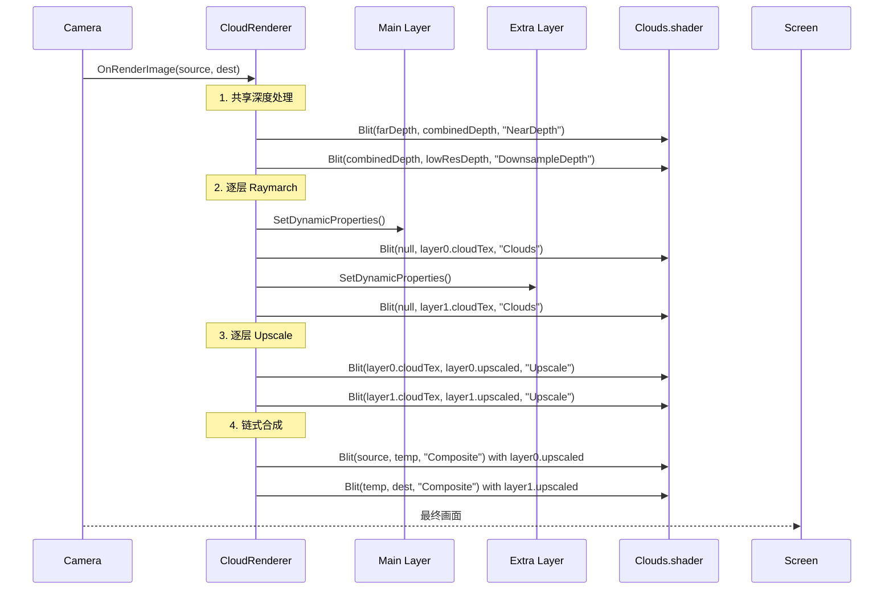

# 多实例云层架构设计方案

## 1. 现状基线

回滚后项目处于最简状态：
- 1个 [`CloudConfig`](Assets/Scripts/Volken/CloudConfig.cs:12) — 约40个渲染参数
- 1个 [`CloudRenderer`](Assets/Scripts/Volken/CloudRenderer.cs:20) — 完整6-pass渲染管线
- 1个 [`Clouds.shader`](Assets/Scripts/Volken/Clouds.shader:1) — FarDepth / NearDepth / DownsampleDepth / Clouds / Upscale / Composite
- 1组噪声纹理 — worley + detail + planetMap + blueNoise
- [`Volken`](Assets/Scripts/Volken/Volken.cs:9) 管理单例，持有上述所有引用

## 2. 设计目标

支持 N 层**完全独立参数**的云层：
- 每层拥有独立的 `CloudConfig`（所有参数独立可调）
- 每层拥有独立的噪声纹理（不同种子，视觉不重复）
- 每层拥有独立的 `Material` 实例（同一 `Clouds.shader`，不同参数值）
- 每层可独立启用/禁用
- 所有层按顺序合成到最终画面
- **默认零视觉干扰**：两层云互不遮挡（Additive 模式），可选切换为物理遮挡（Standard 模式）
- **零代码重复**：不复制任何类，用多实例替代

## 3. 架构概览

```mermaid
graph TD
    V[Volken Singleton]
    V --> CL0[CloudLayer[0] - Main]
    V --> CL1[CloudLayer[1] - Extra 1]
    V --> CL2[CloudLayer[2] - Extra 2]
    V --> CR[CloudRenderer MonoBehaviour]
    V --> UI[VolkenUserInterface]

    CL0 --> C0[CloudConfig]
    CL0 --> M0[Material from Clouds.shader]
    CL0 --> N0[CloudNoise - seed:0]
    CL0 --> RT0[RenderTextures]

    CL1 --> C1[CloudConfig]
    CL1 --> M1[Material from Clouds.shader]
    CL1 --> N1[CloudNoise - seed:42]
    CL1 --> RT1[RenderTextures]

    CL2 --> C2[CloudConfig]
    CL2 --> M2[Material from Clouds.shader]
    CL2 --> N2[CloudNoise - seed:123]
    CL2 --> RT2[RenderTextures]

    CR -->|遍历所有启用的层| CL0
    CR -->|逐层渲染| CL1
    CR -->|链式合成| CL2

    UI -->|动态生成每层控件| V
```

## 4. 核心类设计

### 4.1 `CompositeMode` 枚举 (新增到 `CloudConfig.cs`)

控制每层云与其它层的合成方式：

```csharp
public enum CompositeMode
{
    Additive,  // 加法合成：result.rgb += cloudColor (零干扰，默认)
    Standard   // 标准合成：result = src * transmittance + cloudColor (物理遮挡)
}
```

### 4.2 `CloudLayer` (新文件: `Assets/Scripts/Volken/CloudLayer.cs`)

封装单个云层的完整状态：配置 + 材质 + 噪声 + 渲染目标。

```csharp
public class CloudLayer
{
    // 标识
    public int layerIndex;
    public string name;              // "Main", "Extra 1", "Extra 2"
    public bool isMainLayer;         // 主层有特殊行为(如SOI切换时enable/disable逻辑)

    // 配置
    public CloudConfig config;
    public string currentConfigName;

    // 渲染
    public Material material;        // 独立 Material 实例
    public RenderTexture cloudTex;
    public RenderTexture upscaledCloudTex;
    public RenderTexture historyTex;
    public RenderTexture historyDepthTex;

    // 噪声
    public CloudNoise noise;
    public RenderTexture worleyTex;
    public RenderTexture detailTex;
    public Texture2D planetMapTex;
    public Texture2D blueNoiseTex;

    // 动态状态
    public float accumulatedRotation;
    public float currentResolutionScale;
    public Matrix4x4 prevViewProjMat;  // 每层独立的历史重投影矩阵

    // 方法
    public void GenerateNoiseTextures();
    public void SetShaderProperties();    // 一次性设置(静态参数)
    public void ReleaseRenderTextures();
    public void CreateRenderTextures(int screenW, int screenH);
}
```

### 4.2 `Volken` 修改

将现有的单层字段替换为多层列表：

```diff
- public CloudConfig cloudConfig;
- public string currentConfigName;
- public Material mat;
- public CloudRenderer cloudRenderer;
- public RenderTexture whorleyTex, whorleyDetailTex;
- public Texture2D planetMapTex, blueNoiseTex;
- private CloudNoise _noise;

+ public List<CloudLayer> layers = new List<CloudLayer>();
+ public CloudRenderer cloudRenderer;
+
+ // 便捷属性
+ public CloudLayer MainLayer => layers[0];
+ public int ExtraLayerCount => layers.Count - 1;
+ public IEnumerable<CloudLayer> ActiveLayers => layers.Where(l => l.config.enabled);
```

构造函数中初始化 MainLayer + N 个 ExtraLayer：

```csharp
private Volken()
{
    mat = new Material(...); // 保留作为模板，或用 MainLayer.material
    // 初始化主层
    layers.Add(new CloudLayer { isMainLayer = true, name = "Main", noise = new CloudNoise(seed:0) });
    // 初始化额外层
    layers.Add(new CloudLayer { isMainLayer = false, name = "Extra 1", noise = new CloudNoise(seed:42) });
    layers.Add(new CloudLayer { isMainLayer = false, name = "Extra 2", noise = new CloudNoise(seed:123) });
    
    foreach (var layer in layers) {
        layer.material = new Material(shader);
        layer.GenerateNoiseTextures();
    }
}
```

### 4.3 `CloudRenderer` 修改

核心变化：`OnRenderImage` 中循环所有启用层，根据每层的 `compositeMode` 选择合成方式。

```csharp
[ImageEffectOpaque]
private void OnRenderImage(RenderTexture source, RenderTexture destination)
{
    // 1. 深度捕获 (共享，一次)
    if (FarCameraScript.farDepthTex == null) {
        Graphics.Blit(source, destination);
        return;
    }

    var activeLayers = Volken.Instance.ActiveLayers.ToList();
    if (activeLayers.Count == 0) {
        Graphics.Blit(source, destination);
        return;
    }

    // 检查分辨率变化，重建所有层的 RT
    foreach (var layer in activeLayers) {
        if (Mathf.Abs(layer.currentResolutionScale - layer.config.resolutionScale) > 0.001f) {
            layer.ReleaseRenderTextures();
            layer.currentResolutionScale = layer.config.resolutionScale;
            layer.CreateRenderTextures(Screen.width, Screen.height);
        }
    }

    // 2. 深度处理 (共享，一次)
    Graphics.Blit(FarCameraScript.farDepthTex, combinedDepthTex, sharedMat, nearDepthPass);
    Graphics.Blit(combinedDepthTex, lowResDepthTex, sharedMat, downsamplePass);

    // 3. 渲染每层云 (独立的 raymarch)
    foreach (var layer in activeLayers) {
        SetLayerDynamicProperties(layer);
        layer.material.SetTexture("DepthTex", lowResDepthTex);
        layer.material.SetTexture("HistoryTex", layer.historyTex);
        layer.material.SetTexture("HistoryDepthTex", layer.historyDepthTex);
        Graphics.Blit(null, layer.cloudTex, layer.material, cloudsPass);
        Graphics.Blit(layer.cloudTex, layer.historyTex);
        Graphics.Blit(lowResDepthTex, layer.historyDepthTex);
    }

    // 4. 升采样每层
    foreach (var layer in activeLayers) {
        layer.material.SetTexture("CombinedDepthTex", combinedDepthTex);
        layer.material.SetTexture("LowResDepthTex", lowResDepthTex);
        Graphics.Blit(layer.cloudTex, layer.upscaledCloudTex, layer.material, upscalePass);
    }

    // 5. 合成: 根据每层的 compositeMode 选择策略
    RenderTexture result = RenderTexture.GetTemporary(source.width, source.height, 0, source.format);
    Graphics.Blit(source, result);

    foreach (var layer in activeLayers) {
        sharedMat.SetTexture("UpscaledCloudTex", layer.upscaledCloudTex);
        sharedMat.SetTexture("SceneDepthTex", combinedDepthTex);
        // 设置合成模式: 0=Additive, 1=Standard
        sharedMat.SetFloat("_CompositeMode", layer.config.compositeMode == CompositeMode.Standard ? 1.0f : 0.0f);

        var temp = RenderTexture.GetTemporary(source.width, source.height, 0, source.format);
        Graphics.Blit(result, temp, sharedMat, compositePass);
        RenderTexture.ReleaseTemporary(result);
        result = temp;
    }

    Graphics.Blit(result, destination);
    RenderTexture.ReleaseTemporary(result);
}
```

### 4.4 `CloudConfig` 修改 — 新增 `compositeMode` 字段

```diff
+ public CompositeMode compositeMode = CompositeMode.Additive;
```

- XML 序列化：枚举可存为 int 或 string
- `Clone()` / `CopyFrom()` 需要同步新增该字段
- 默认值 `Additive` 确保所有层默认零干扰

### 4.5 `Clouds.shader` 修改 — Composite pass 增加模式分支

在 Composite pass 的 `frag` 函数中，根据 `_CompositeMode` 选择公式：

```hlsl
// 新增 uniform
float _CompositeMode;  // 0.0 = Additive, 1.0 = Standard

float4 frag(v2f i) : SV_Target
{
    float4 clouds = UpscaledCloudTex.Sample(samplerUpscaledCloudTex, i.uv);
    float4 source = tex2D(_MainTex, i.uv);
    float sceneDepth = SceneDepthTex.Sample(samplerSceneDepthTex, i.uv);

    if (_CompositeMode < 0.5)
    {
        // === Additive Mode (零干扰) ===
        // 直接将云光加到场景上，不改变场景透过率
        return float4(source.rgb + clouds.rgb, source.a);
    }
    else
    {
        // === Standard Mode (物理遮挡) ===
        // 现有的标准合成逻辑：
        float nearThreshold = _NearThreshold;
        if (sceneDepth > 0.0 && sceneDepth < nearThreshold)
        {
            float nearFactor = smoothstep(0.0, nearThreshold, sceneDepth);
            nearFactor = lerp(0.2, 1.0, nearFactor);
            float3 finalCloudColor = clouds.rgb * nearFactor;
            float finalTransmittance = lerp(0.8, clouds.a, nearFactor);
            return float4(source.rgb * finalTransmittance + finalCloudColor, source.a);
        }
        else
        {
            float depthThreshold = 5000.0;
            float depthMask = saturate(sceneDepth / depthThreshold);
            float3 maskedCloudColor = clouds.rgb * depthMask;
            float maskedTransmittance = lerp(1.0, clouds.a, depthMask);
            return float4(source.rgb * maskedTransmittance + maskedCloudColor, source.a);
        }
    }
}
```

> **注意**：这要求 shader 的 Composite pass 中新增 `_CompositeMode` uniform（一行声明），其余逻辑仅是加一个 `if` 分支。

### 4.6 合成模式视觉效果对比

```
Additive (默认):
  Layer 0 渲染 → cloudColor0
  Layer 1 渲染 → cloudColor1
  最终 = source + cloudColor0 + cloudColor1
  两层的云光直接叠加，互不遮挡，各自独立可见

Standard (可选):
  Layer 0 合成 → temp = source * T0 + C0
  Layer 1 合成 → final = temp * T1 + C1
  上层云的 transmittance 会衰减下层，产生物理遮挡效果
```

### 4.7 不需要修改的文件

现有以下文件无需修改：
- `CloudNoise.cs` — 噪声生成逻辑不变，每层独立调用
- `DepthCapture.cs` — 深度捕获逻辑不变
- `FarCameraScript.cs` — 远相机深度不变
- `SerializableTypes.cs` — 序列化辅助类不变

### 4.5 `VolkenUserInterface` 修改

`CreateInspectorPanel()` 中为每层动态生成 UI 组：

```csharp
// Main Layer (保持现有 UI 结构不变，但引用改为 layers[0].config)
GroupModel mainCloudGroup = CreateLayerGroup("Main", Volken.Instance.MainLayer);

// Extra Layers
for (int i = 1; i < Volken.Instance.layers.Count; i++) {
    GroupModel extraGroup = CreateLayerGroup($"Extra {i}", Volken.Instance.layers[i]);
    inspectorModel.Add(extraGroup);
}
```

`CreateLayerGroup(string title, CloudLayer layer)` 方法提取现有 UI 创建逻辑，参数化 layer 引用。

> **简化策略**：Extra 层 UI 可以比 Main 层精简，只暴露最常用参数（density, coverage, layer heights, color），避免 UI 过于冗长。也可以用折叠面板(CollapsibleGroup)。

## 5. 数据流图



## 6. 文件变更清单

| 操作 | 文件 | 说明 | 状态 |
|------|------|------|------|
| **新建** | `Assets/Scripts/Volken/CloudLayer.cs` | CloudLayer 封装类 (~150行) | ✅ 完成 |
| **修改** | `Assets/Scripts/Volken/CloudConfig.cs` | 新增 `CompositeMode` 枚举 + `compositeMode` 字段 | ✅ 完成 |
| **修改** | `Assets/Scripts/Volken/Volken.cs` | layers 列表 + InitializeLayers() + backward-compat | ✅ 完成 |
| **修改** | `Assets/Scripts/Volken/CloudRenderer.cs` | 完全重写：多实例循环渲染 + 链式合成 + 双模 | ✅ 完成 |
| **修改** | `Assets/Scripts/Volken/VolkenUserInterface.cs` | CreateLayerGroup/ExtraLayerGroup 按层生成UI | ✅ 完成 |
| **微调** | `Assets/Scripts/Volken/Clouds.shader` | Composite pass 新增 `_CompositeMode` 分支 | ✅ 完成 |
| **不变** | `Assets/Scripts/Volken/CloudNoise.cs` | 无需修改 | ✅ |
| **不变** | `Assets/Scripts/Volken/DepthCapture.cs` | 无需修改 | ✅ |
| **不变** | `Assets/Scripts/Volken/FarCameraScript.cs` | 无需修改 | ✅ |

## 7. 关键风险与注意事项

### 7.1 性能
- 2层云 = 2x raymarch 开销（每层最多350次迭代 + 光照采样）
- 建议 Extra 层默认使用更低的 `resolutionScale`（如 0.3）和更少的 `numLightSamplePoints`（如 10）
- 用户可在 UI 中调整每层的质量参数

### 7.2 深度纹理共享
- `combinedDepthTex` 和 `lowResDepthTex` 所有层共用（只捕获一次）
- 这要求所有层使用相同的 `depthThreshold` 逻辑，或深度纹理足够通用

### 7.3 历史缓冲 (History Buffer)
- 每层有独立的 `historyTex` 和 `historyDepthTex`
- 需要正确设置每层的 `reprojMat`（前一帧的 ViewProjection 矩阵）
- 需要在 `SetLayerDynamicProperties()` 中为每层维护独立的 `prevViewProjMat`

### 7.4 Wind/Offset 独立更新
- 当前 offset 更新在 `CloudRenderer.SetDynamicProperties()` 中
- 需要改为每层独立累积，存储在 `CloudLayer.accumulatedRotation` 中
- offset 也应该存储在 `CloudLayer` 中，而不是直接在 config 上修改（当前会修改 config 对象导致序列化问题）

### 7.5 配置管理
- 每层独立的配置序列化：`/UserData/VolkenConfig/{planet}/{layerName}_{configName}.xml`
- 或者每层用子目录：`/UserData/VolkenConfig/{planet}/Layer0/`, `/UserData/VolkenConfig/{planet}/Layer1/`

## 8. 可选增强

以下为可选改进，不作为初版必须实现：

- [ ] Extra 层支持独立的 `containerOffset`/`containerScale`（原 ExtraCloudConfig 的容器变换参数）
  - 实现方式：在 `CloudConfig` 中添加这3个字段（默认为0/1/1，不影响现有行为）
- [ ] 支持运行时添加/删除层
- [ ] 层间混合模式（additive / alpha blend / max）
- [ ] 预设层配置模板（如"高层卷云"、"低层积云"等快速切换）

## 9. 实现完成总结

### 已完成的核心改动

1. **CloudLayer.cs** — 封装每层完整状态（配置/材质/噪声/RT/动态状态），每层独立 `GenerateNoiseTextures()` 使用不同种子

2. **CloudConfig.cs** — 新增 `CompositeMode` 枚举 (Additive/Standard)，`compositeMode` 字段默认 Additive，Clone/CopyFrom 已同步

3. **Volken.cs** — `layers: List<CloudLayer>` 替代单层字段，`InitializeLayers()` 创建 Main(seed:0) + Extra1(seed:42，默认禁用)，backward-compat 属性 `cloudConfig`/`currentConfigName` 代理到 MainLayer

4. **CloudRenderer.cs** — 完全重写：
   - 共享深度RT（`combinedDepthTex`/`lowResDepthTex`）一次捕获
   - `SetLayerDynamicProperties()` 为每层独立计算 wind/rotation/reprojection（不再污染 config.offset）
   - `OnRenderImage` 循环：深度处理 → 逐层Raymarch → 逐层Upscale → 链式Composite（根据 `_CompositeMode` 选择 Additive/Standard）
   - `SetAllLayersShaderProperties()` 供 `ValueChanged()` 调用

5. **Clouds.shader** — Composite pass 新增 `float _CompositeMode`，Additive 模式直接 `source.rgb + clouds.rgb`

6. **VolkenUserInterface.cs** — 
   - `CreateLayerGroup()` 生成主层完整UI（含 CompositeMode 下拉框 + 所有参数）
   - `CreateExtraLayerGroup()` 生成额外层精简UI（toggle + mode + 关键参数）
   - `CreateSlider()` 辅助方法减少重复代码
   - Config 管理（保存/加载/重置）仍作用于 MainLayer
